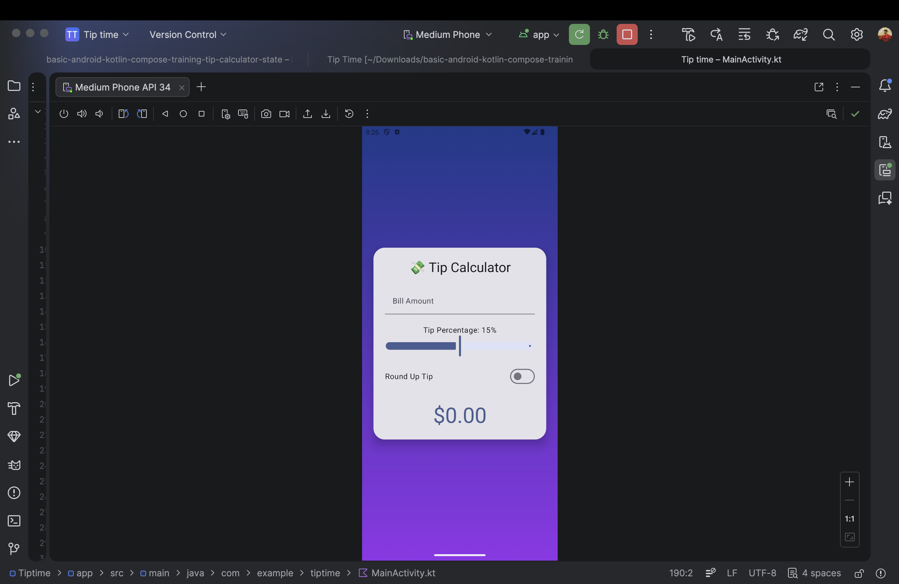

# 💸 TipTime - Modern Tip Calculator

A modern Android Tip Calculator built using **Jetpack Compose** and **Material 3**.

This project demonstrates clean UI design, state management in Compose, and animated UI updates.

---

## 📸 App Preview

---

## 🚀 Features

- 🎨 Gradient background UI
- 📊 Slider-based tip percentage selection
- 🔁 Round-up tip option
- ⚡ Real-time animated tip calculation
- 📱 Fully built with Jetpack Compose
- 🎯 Material 3 components

---

## 🛠 Tech Stack

- Kotlin
- Jetpack Compose
- Material 3
- Compose Animation APIs
- Android Studio

---

## 📂 Project Structure

- `MainActivity.kt` – UI and logic
- Compose UI components
- Tip calculation function with rounding logic

---

## 🎯 What I Practiced

- State management using `remember`
- Composable UI structuring
- Material 3 design
- AnimatedContent
- Modern UI styling

---

## 👨‍💻 Author

**Fahad Umar Farooq**  
Final Year Computer Science & Design Engineering  
Android Developer | Cloud Enthusiast

---

⭐ If you like this project, feel free to star it!
